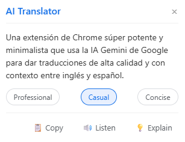

# AI Translator Chrome Extension (Powered by Gemini)

A powerful, minimalist Chrome extension that leverages Google's Gemini AI to provide high-quality, context-aware translations between English and Spanish.

## ✨ Key Features

### 🧠 Smart AI Translation
*   **🎯 Contextual Tones**: Choose between **Professional**, **Casual**, and **Concise** translation modes to fit your specific needs.
*   **📖 Dictionary Mode (Smart Detect)**: Automatically detects when you select a single word (or two) and provides definitions, parts of speech, and synonyms instead of a simple translation.
*   **💡 Explain This**: Get instant AI-powered insights into the context, idioms, or double meanings of any phrase.

### ⚡ Productivity Tools
*   **🔊 Text-to-Speech (TTS)**: Listen to the translation with native pronunciation (auto-detects English/Spanish).
*   **📋 Quick Copy**: Copy results to your clipboard with a single click.
*   **🔄 Smart Replacement**: Option to automatically replace the selected text with the translation—ideal for writing emails or coding directly in the browser.

### 🚀 Performance & Design
*   **Multiple Access Points**:
    *   **Right-click**: Context menu integration.
    *   **Keyboard Shortcut**: `Alt+T` (customizable) for instant access.
    *   **Floating UI**: Interactive popup with glassmorphism design.
*   **Gemini Powered**: Supports the latest models (Gemini 1.5 Flash, 2.0 Flash, etc.).

## 🛠️ Installation

**The easiest way:**
1.  Download the latest release ZIP file from the [Releases page](https://github.com/enrelu/AITranslator/archive/refs/tags/v1.0.0.zip) (or download `ai-translator-v1.0.0.zip` directly).
2.  Extract the downloaded ZIP file into a folder on your computer.
3.  Open Chrome and navigate to `chrome://extensions/`.
4.  Enable **"Developer mode"** in the top right corner.
5.  Click **"Load unpacked"** and select the folder where you extracted the extension.

**From source:**
1.  Clone this repository: `git clone https://github.com/enrelu/AITranslator.git`
2.  Follow steps 3-5 above, selecting the cloned repository folder.

## 🔑 Setup

1.  Get your **API Key** from [Google AI Studio](https://aistudio.google.com/).
2.  Click the extension icon in Chrome.
3.  Paste your key in the settings and click **Save**.
4.  (Optional) Customize the keyboard shortcut by clicking "Configure keyboard shortcuts" in the popup.

## 🎮 How to Use

1.  **Select text** on any webpage.
2.  Press **`Alt+T`** OR Right-click and select **"Translate with Gemini"**.
3.  The **Floating Popup** will appear with the translation.
4.  Use the icons to **Listen** 🔊, **Copy** 📋, or **Explain** 💡 the context.
